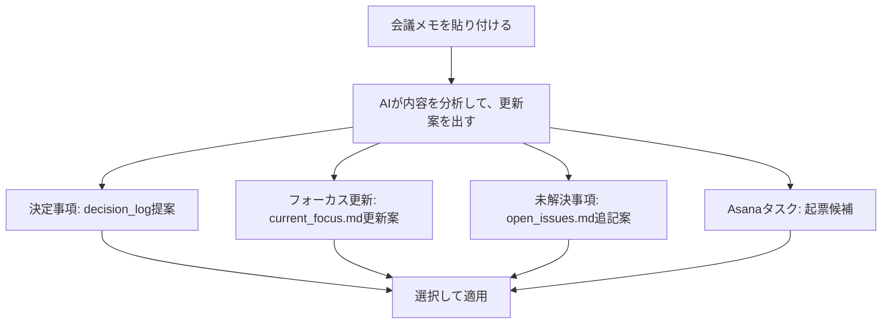
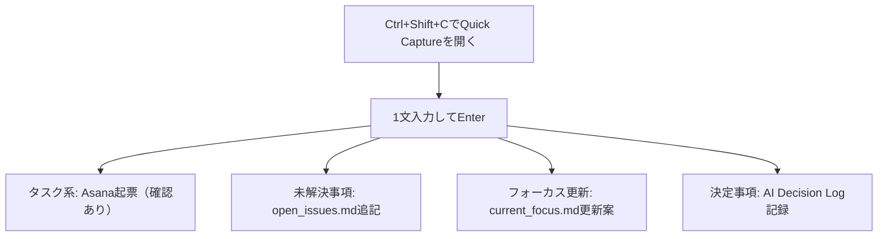

## 複数プロジェクトで文脈を共有し続けるのは意外と手間

Claude CodeやCodex CLIを複数プロジェクトで使っていると、定期的に発生する作業があります。

それは、**セッション開始時のコンテキスト復元**です。

- このプロジェクトの目的は何か
- いまどこまで進んでいるか
- なぜその設計を選んだか
- 何をやらないと決めたか

Claude Codeに都度必要な情報を渡す運用でも十分使えますが、背景情報が薄いと、AIからの提案の精度はぶれやすくなります。毎回セッション前に説明を組み立てるのも、地味に手間がかかります。

Curiaでやっていることは次の3点です。

- `current_focus.md` / `decision_log` / `open_issues.md`等のコンテキストファイルをプロジェクト単位で維持する
- `Quick Capture`などのAI補助機能で、プロジェクトごとのコンテキストファイルの更新を「面倒な作業」ではなく「短時間ルーチン」にする
- Claude Code / Codex CLI がそのまま読める形（Markdown）で文脈を残す

狙っているのは、AIの性能を盛ることより、**AIが読む記憶を新しい状態で保つこと**です。

この問題を減らすために、Windowsのシステムトレイに常駐するアプリ **Curia** を作りました。
※Mac非対応です。

https://github.com/yt3trees/Curia


Curiaは、プロジェクトごとにコンテキストファイルを管理し、Claude CodeやCodex CLIがそれを直接読み書きできるようにすることで、セッション開始時の説明コストを大幅に減らすことができるWindowsデスクトップアプリです。
ホットキー`Ctrl+Shift+P`でいつでも呼び出せます。

CuriaのEditorで更新した `current_focus.md` / `decision_log` / `open_issues.md` などのコンテキストファイルは、そのままClaude Codeから参照できます。
※`AGENTS.md` や Agent Skill 側にこれらのファイルを読み取る指示を入れています。`AGENTS.md` と Skill ファイルもCuriaが作成・管理します。

デモ動画
https://youtu.be/UjSIIvchFkg

やっていることはシンプルです。

- プロジェクトフォルダごとに `_ai-context/` を用意
- 状況・意思決定・未解決事項をMarkdownで管理
- Curiaで更新・可視化・横断管理

Claude CodeやCodex CLIはこれらのファイルをそのまま読めるので、特別な連携設定は不要です。

Curiaで作成する基本フォルダ構成

```text
MyProject/
├── .claude/skills/
├── development/source/       # ローカルリポジトリ
├── shared/                   # クラウド同期ファイル (ジャンクション)
│   ├── _work/                # 日次作業ログフォルダ (Timelineで使用)
│   │   └── 2026/202604/20260411_feature-name/
│   ├── docs/                 # 共有ドキュメント
│   └── .claude/skills/
└── _ai-context/context/
    ├── current_focus.md      # 今取り組んでいること
    ├── project_summary.md    # 概要・技術スタック・アーキテクチャ
    ├── open_issues.md        # 未解決事項・懸念点
    ├── decision_log/         # 意思決定ログ
    └── wiki/                 # プロジェクト知識ベース
```

## 🧩 主な機能x5

### 1. 全プロジェクトの状況を一画面で把握できる: Dashboard


各プロジェクトのコンテキストファイルの更新日、未コミット変更などを横断で確認できます。

Dashboardでは、プロジェクトごとの更新状況や未コミット変更をまとめて見られるので、まず「どの案件から触るか」を決める起点として使っています。

### 2. コンテキストファイルを日常的に更新する: Editor

`current_focus.md` / `decision_log` / `open_issues.md` / `tasks.md` などを1つの画面で編集できます。

後述しますが、AI機能を有効にしている場合は、Update Focus from Asana / AI Decision Log / Import Meeting Notes といった支援機能もここから使えます。

https://youtu.be/b9jS8lC2rHs

### 3. 記録を続けやすくする: Quick Capture（`Ctrl+Shift+C`）

https://youtu.be/-Iugel8LVFw

作業中のメモを自然文で入れると、AIが内容を判定して反映先を振り分けます。
反映したファイルはClaude Codeが適宜参照できるMarkdownファイルになります。
Claude Code用だけではなく、人間が見てもわかりやすい形でプロジェクトの状況を記録できるのがポイントです。

- タスク系: Asanaタスク作成 or `tasks.md` 追記
- 意思決定系: `decision_log/` に新規ファイル作成
- 課題系: `open_issues.md` に追記

### 4. 「調べ直し地獄」を減らす: Wiki

この機能は、Andrej Karpathy の「[LLM Wiki](https://gist.github.com/karpathy/442a6bf555914893e9891c11519de94f)」の考え方を参考にしています。要点は、質問のたびに生データから再推論するのではなく、**LLMが永続的なWikiを育て続ける**ことです。

`.md` / `.txt` / `.pdf` を Import すると、ソースは `wiki/raw/` に保存され、LLMが `sources` / `entities` / `concepts` のページを新規作成・更新します。あわせて `index.md`（索引）と `log.md`（履歴）も更新されます。

ざっくりこんな構成になります。

```text
wiki/
└── <domain>/                 # Wikiテーマ / ドメインごとのフォルダ
    ├── raw/                  # 取り込んだ元ファイル
    ├── pages/
    │   ├── sources/          # ソースごとの要約ページ
    │   ├── entities/         # 具体的な対象（画面/API/テーブル等）
    │   ├── concepts/         # 設計思想・ルール・方針
    │   └── analysis/         # Query結果の保存先
    ├── index.md              # ページ索引
    └── log.md                # 更新履歴
```

変更は差分レビューで承認してから保存され、Query の回答は `analysis` ページとして蓄積できます。さらに Lint でリンク切れ・孤立・矛盾を点検できるため、Wikiを一度きりの回答ではなく、継続的に精度が上がる知識ベースとして運用できます。

https://youtu.be/5-gugmxLc_k

### 5. エージェント定義やルールを管理しやすくする: Agent Hub

`Agent Hub` では、Agent Skillや、Sub Agentの定義やコンテキストルールをライブラリとして管理できます。

Claude Code / Codex CLI などCLIごとに Deploy / Undeploy できるので、案件ごとの切り替えがしやすくなります。

https://youtu.be/Jew3j0o63q4

## 🧭 基本的な運用フロー

私が基本にしているのは、次の流れです。

1. `Ctrl+Shift+P` でCuriaを開く
2. Dashboardで全体状況を見て、触る案件を決める
3. CuriaのEditorで `current_focus.md` などを確認してから、Claude Codeを使って仕事をする
4. 作業中に方針や状況が変わったら、Editorでコンテキストを更新する
5. 作業中のメモはQuick Captureで残す
6. 必要に応じて `decision_log` / Wiki / Agent Hub を更新する

:::message
無理に全部やる必要はなく、**その日に動いた文脈をどこか1か所は更新して終わる**だけで十分です。
:::

## 🤖 この運用を支えるAI機能

**CuriaのAI機能は、日々の把握・記録・更新を補助して、コンテキストファイルを継続的にメンテするための機能です。**

使い方としては、次の2つに分けるとしっくりきます。

- 日次運用（Dashboard / Editor / Quick Capture）: いま進めている仕事の状況を更新し続けるための機能群
- ナレッジ運用（Wiki）: プロジェクト知識を構造化して蓄積し、あとから再利用するための機能

前者で「今日の文脈」を維持し、後者で「長期の知識」を育てるイメージです。これを続けると、セッションのたびにゼロから説明し直すことが減っていきます。

## DashboardのAI機能で、今日触る案件を決める

### What's Next: 優先順位の初期案を短時間で作る

What's Next は、全プロジェクトをまたいで3〜5件の次アクションを提案してくれます。判断材料は、たとえば次のようなものです。


- `current_focus.md` の鮮度
- 期限切れ/期限接近タスク
- 未コミット変更
- `decision_log` の不足感

:::message
What's Next は「正解」ではなく、**優先順位を考えるための叩き台**として使うのがコツです。
:::

朝イチに自分の頭だけで優先順位を組むと、どうしても直近で触った案件に引っ張られます。What's Nextを先に見ると、放置している高リスク案件が可視化されやすい。

### Context Briefing: 中断後の再開コストを下げる

プロジェクトカードごとのContext Briefingは、プロジェクトの作業再開時に有効です。


- Where you left off（どこまでやったか）
- Suggested next steps（次に何をやるか）
- Key context（忘れがちな前提）

この3点セットがあると、前日から間が空いた案件でも10分以内に手が動きます。特に複数案件を並行しているとき、脳内キャッシュの入れ直し時間が短くなるのが大きいです。

### Today's Plan: 優先事項を1日の時間配分に落とす

What's Nextが「何をやるか」なら、Today's Planは「いつやるか」です。


現状タスクに対する工数情報を登録するようになっていないため、正直参考程度の機能ですが、優先事項を時間帯に落とすきっかけにはなります。

## EditorのAI機能で、コンテキスト更新を続ける

### Update Focus from Task: `current_focus.md` を腐らせない

`current_focus.md` は、AIエージェントとの協業で最も参照されるファイルです。
ただし手書きで保守し続けるのは地味に大変で、気づくと古くなります。

Update Focus from Taskは、Asana等のタスク情報と既存 `current_focus.md` を見て、構成と文体を保った差分更新案を出します。ここが使いやすいポイントです。


- 変更前バックアップが `focus_history/` に残る
- そのまま確定せずレビュー・AIへの修正指示ができる

結果として「更新の心理的コスト」が下がり、更新頻度が上がります。

### AI Decision Log: 「なぜそうしたか」を後で説明できる形にする

設計判断は、決める瞬間より「あとで思い出す」ほうが難しいです。

AI Decision Logは、次のような枠を埋める形で意思決定を構造化してくれます。


- Options（選択肢）
- Why（採用理由）
- Risk（副作用・懸念）
- Revisit Trigger（見直し条件）

この4つが残ると、数週間後に「なぜこうしたんだっけ？」が減ります。
さらに、`open_issues.md` の解消済み項目を片付ける運用にもつながるので、課題管理の鮮度も維持しやすいです。

### Import Meeting Notes: 会議メモを作業可能な粒度に分解する

会議メモは、記録して終わるとほぼ再利用されません。
Import Meeting Notesは、この死蔵を防ぐ機能です。

1回の解析で、会議メモを複数の成果物に分配できます。


- 決定事項: `decision_log` 化
- フォーカス更新: `current_focus.md` 更新案
- 未解決事項: `open_issues.md` 追記案
- Asanaタスク: 起票候補



個人的に効いたのは、**会議後5分で「作業可能な単位」に変換できる**点です。
議事録のままだと曖昧だった論点が、タスク・課題・判断に分解されるので、翌日の再開が楽になります。

## Quick Captureで記録を習慣化する

Quick Captureは `Ctrl+Shift+C` でどこからでも呼び出せます。1文入力してEnterを押すと、AI有効時は内容を分類して反映先を自動で振り分けます。

- タスク系: Asana APIでタスク起票（送信前に確認あり）
- 未解決事項: `open_issues.md` へ追記
- フォーカス更新: Editorを開いて current_focus.md 更新案を表示
- 決定事項: Editorを開いて AI Decision Log フローを起動



この振り分けがあるので、「あとで整理しよう」と先送りしにくくなります。

https://youtu.be/-Iugel8LVFw

## Wikiを「再利用できる知識」として育てる

Wikiタブの狙いは、単発で「答えを返す」ことではなく、**あとで何度も使える知識を育てること**です。

このWiki機能はAndrej Karpathyの「[LLM Wiki](https://gist.github.com/karpathy/442a6bf555914893e9891c11519de94f)」を参考にしています。
「毎回ゼロから調べる」のではなく、調べた内容を構造化して次回以降に再利用できる状態へ寄せていきます。

https://youtu.be/5-gugmxLc_k

運用の中心は `Import` です。ここで知識ベースとしての土台を作ります。

### Import: 生データを「再利用できるページ」に変える

ドキュメントを取り込むと、ソースは `wiki/raw/` に保存され、
LLMが `sources` / `entities` / `concepts` のページを作成・更新します。
同時に `index.md`（索引）と `log.md`（履歴）も更新されます。

- `sources`: 元資料ごとの要点
- `entities`: 画面・API・テーブルなど「対象」
- `concepts`: ルール・設計方針・判断基準など「考え方」

この分解があるので、後から見返すときに「どこに何があるか」が崩れにくくなります。
差分レビューしてから保存する流れも含めて、知識を雑に増やさず、品質を保ったまま育てられます。

### Query: 蓄積したWikiに質問できる

Queryは、育てたWikiに自然文で質問できる機能です。
回答は `analysis` ページとして保存できるので、必要なら再利用できます。

### Lint: Wikiが壊れていないか点検できる

Lintは、リンク切れ・孤立・矛盾などを検知して、知識ベースの劣化を早めに見つけるための機能です。
「積み上げた知識を使い続けられる状態」に保つための定期点検として使えます。

つまりWikiは、検索の代替ではなく、**知見を再利用可能な資産に変える仕組み**です。

## Agent Hubでエージェント定義の管理をラクにする

Claude Code / Codex CLI など複数CLIを使い分けると、サブエージェント定義やコンテキストルールの置き場所が分かれがちです。
Curiaの `Agent Hub` では、これらをライブラリとして管理し、プロジェクト別、CLI別に Deploy / Undeploy できます。

- どの定義を使うかをUIで把握しやすい
- 案件ごとに適用セットを切り替えやすい
- Claude Code / Codex CLI など複数CLI運用で設定差分を管理しやすい

複数CLIや複数案件をまたぐときの、定義管理をシンプルにしてくれる便利機能です。

https://youtu.be/Jew3j0o63q4


## 🚀 まず試すならこの最小構成

機能は多いですが、最初は `Setup` / `Dashboard` / `Editor` の3つだけで十分です。
READMEと日次ワークフローに沿って、次の順で始めると迷いません。

### Step 1: Setupで土台を作る（最初に1回だけ）

https://youtu.be/zsfZw-91eWg

- `Settings` でCuriaで管理するルートフォルダパスを設定（Local Projects / Cloud Sync / Obsidian Vault）
- `Setup Project` でプロジェクト作成
- 生成された `current_focus.md` / `open_issues.md` / `decision_log/` を確認

ここまでで、AIなしでも回せる運用基盤ができます。

### Step 2: 毎日の運用はDashboard→Editorだけ

- `Dashboard` で触るプロジェクトを決める
- `Editor` で `current_focus.md` を更新（`Ctrl+S` で保存）
- 重要な判断が発生したら、 `decision_log` に残す

この3アクションを回すだけで、再開コストはかなり下がります。

### Step 3: 必要になったらAI機能を足す

- 朝の優先順位づけに `What's Next`
- 終業前の更新補助に `Update Focus from Asana`
- 会議後の整理に `Import Meeting Notes`

:::message
Asana連携やWikiは必須ではありません。まずは current_focus.md の運用が回ってから追加で十分です。
:::

## 技術スタック

- WPF + .NET 9
- 単一ファイル実行形式（インストーラー不要）
- 対応LLM: OpenAI / Azure OpenAI / Claude Code CLI / Gemini CLI / Codex CLI / GitHub Copilot CLI
- コンテキストはすべてプレーンMarkdown（ロックインなし）

## まとめ

日々の業務でAIエージェントを活用するうえで重要なのは、モデル選びよりコンテキスト運用です。
Curiaは、この運用を日常の中で回しやすくするためのツールです。

やっていることはシンプルで、次の3つです。

- セッション前の説明を毎回やり直す時間を減らす
- いま何に取り組むべきかを、常に短時間で思い出せる状態にする
- Claude Code などのAIに渡すコンテキストを、日々の更新で常に最新に保つ

この3つが回り始めると、案件の切り替えや作業再開が速くなり、AIへの指示や提案の精度も安定してきます。

セットアップ方法はこちら
https://github.com/yt3trees/Curia/blob/main/README-ja.md#5%E5%88%86%E3%81%A7%E4%BD%BF%E3%81%84%E5%A7%8B%E3%82%81%E3%82%8B
