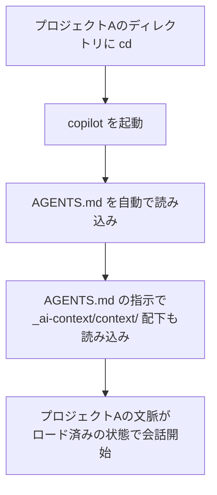

## Copilot CLI に毎回「いまの前提」を伝え直していた

GitHub Copilot CLI(`copilot` コマンド) は、ターミナルでそのまま会話して、編集やコマンド実行まで任せられる便利なエージェントです。

ただ使い込んでいくほど目立ってくるのが、`copilot` を起動するたびに「いまの前提」を伝え直す手間でした。複数のプロジェクトを行き来するようになると、これが一気に重くなります。朝にプロジェクトA、午後はB、夕方にまたA。そのたびに同じような前提を組み立て直しています。

- いまこのプロジェクトで何にフォーカスしているか
- なぜその設計にしたか
- やらないと決めたことは何か
- 未解決のまま残っている課題は何か

1回あたりは数分でも、プロジェクト数が増えるほどこの「説明の組み立て直し」が積み上がります。Copilot が賢くなっても、こちらが渡す前提が薄ければ薄い提案しか返ってきません ― 複数プロジェクトを並行で回しているとき、日々の生産性を握っていたのはモデルの賢さよりも、いまこのプロジェクトの文脈をどれだけ低コストで `copilot` に載せられるか、のほうでした。

この記事は、そのコストを下げるために日々やっている運用の話です。プロジェクトごとに `AGENTS.md` を置いて、`cd` するだけで `copilot` に渡る文脈が切り替わる状態にしてある、というだけの構成です。

## 構成: プロジェクトごとに AGENTS.md と文脈ファイルを持つ

ディレクトリ構成はこんな形です。

```text
~/Projects/
├── project-alpha/                  # プロジェクトA
│   ├── AGENTS.md                   # プロジェクトA用の運用ルール
│   ├── _ai-context/
│   │   └── context/                # 文脈ファイル
│   │       ├── current_focus.md
│   │       ├── project_summary.md
│   │       ├── open_issues.md
│   │       └── decision_log/
│   ├── shared/_work/               # 日次の雑多作業
│   └── development/                # ソースコードのリポジトリ
│
├── project-beta/                   # プロジェクトB (同じ構成)
└── project-gamma/                  # プロジェクトC (同じ構成)
```

プロジェクトごとのリポジトリ直下にそのプロジェクト専用の `AGENTS.md` を置き、その中で「`_ai-context/context/` 配下を必ず読んでから作業を始めて」と書いておきます。

別プロジェクトのディレクトリに `cd` して `copilot` を起動すると、そのプロジェクト用の AGENTS.md と文脈ファイルが読み込まれた状態で会話に入ります。Copilot への説明を毎回組み立てる代わりに、`_ai-context/context/` を更新していくだけの運用になります。

## ディレクトリを「文脈の境界線」にする

ざっくりした流れはこうです。



別プロジェクトで同じことをすれば、読み込まれる AGENTS.md と `_ai-context/context/` がそのまま別物に切り替わります。これが成り立っているのは、Copilot CLI のカスタム命令の仕様のおかげです。[公式ドキュメント](https://docs.github.com/en/copilot/how-tos/copilot-cli/customize-copilot/add-custom-instructions)に書かれている主な配置場所はこんな感じです。

| 種類 | 配置場所 | 動作 |
|---|---|---|
| エージェント命令(主) | リポジトリルートの `AGENTS.md` | 起動時に自動読み込み(優先度: 最高) |
| リポジトリ全体命令 | `.github/copilot-instructions.md` | 起動時に自動読み込み |
| パス指定命令 | `.github/instructions/*.instructions.md` | フロントマターの `applyTo` で適用ファイルパターンを指定 |
| ローカル命令 | `$HOME/.copilot/copilot-instructions.md` | 全プロジェクト共通で読み込み |

リポジトリルートの `AGENTS.md` は、`copilot` 起動時に自動で読み込まれます。`CLAUDE.md` / `GEMINI.md` と並んで Copilot CLI が公式にサポートしているエージェント向け命令ファイルです。

プロジェクトごとに別の AGENTS.md を置いておくだけで、別ディレクトリで起動したときには別の命令セットが渡る ― 明示的な切り替え操作はいらないので、日々の `cd` がそのまま文脈の切り替えになります。

`$HOME/.copilot/copilot-instructions.md` は全プロジェクト共通で読み込まれるので、ここには出力言語(日本語で返す、など) や、プロジェクトによらず守ってほしいスタイルだけを書いておきます。プロジェクト固有の情報を混ぜると別プロジェクトにも引きずられるので、極力薄くしてあります。

## 動作イメージ

実際の挙動はこんな感じです。


`copilot` を起動した直後から、そのプロジェクトの AGENTS.md と `_ai-context/context/` 配下が読み込まれた状態で会話に入っています。最初の1往復から作業の話に入れます。

## AGENTS.md に何を書くか / 何を書かないか

AGENTS.md は長く書くほど効くわけではなく、毎回読ませるファイルなので、Copilot の挙動が実際に変わる情報だけに絞ってあります。自分が雛形にしているのはこんな構成です。

```markdown
# project-alpha - AI Agent Instructions

## Context (READ FIRST)

セッション開始時に、以下を順に読んでから着手すること。

1. `_ai-context/context/current_focus.md` — 今フォーカスしている目的・期日・スコープ
2. `_ai-context/context/project_summary.md` — 概要・技術スタック・アーキテクチャ
3. `_ai-context/context/open_issues.md` — 未解決事項・既知の懸念
4. `_ai-context/context/decision_log/` — 直近の意思決定ログ (新しい順に確認)

読み終えたら未解決事項を1〜2行で要約して返す。
current_focus が3日以上更新されていなければ、進捗をひと言確認する。

## Directory Structure

project-alpha/
├── _ai-context/context/   # 文脈ファイル
├── shared/_work/          # 日次の雑多作業
└── development/           # ソースコード (Git 管理)

## Work Folder Rule

作業ファイルは `shared/_work/yyyy/yyyyMM/yyyyMMdd_{作業名}/` 配下に日付フォルダを作って残す。
```

## 文脈ファイルの中身

`_ai-context/context/` は、Copilot CLI が AGENTS.md の指示で毎回読みに行く先です。役割をファイル単位で分けておくと、どこを更新すればよいか迷いません。自分は4種類に固定しています。

### current_focus.md

「いまこのプロジェクトで何にフォーカスしているか」を書く 1 ファイル。

```markdown
# Current Focus

## 目的
2026-Q2中に、設定画面のLLMプロバイダ追加機能を本番リリースする。

## いま取り組んでいること
- GitHub Copilot CLI を LLM プロバイダ選択肢に追加するUI実装
- 既存の `LlmClientService` への統合(API key不要モードの分岐)

## 今週のスコープ
- Settings ページに `github_copilot` 選択肢を追加
- Test Connection の動作確認

## やらない(今は)
- CLI 認証フローのアプリ内ラッピング
- Copilot CLI 以外のCLIプロバイダ追加
```

ここが最新になっていれば、`copilot` に渡る前提の鮮度はだいたい保てます。2週間前のまま放置していると、起動するたびに古い前提で提案が返ってくるので、あとで違和感に気づきます。

### decision_log/

設計判断を 1 ファイル 1 件で残します。あとで「なぜこうしたか」を引っ張り出すためのファイルです。

```markdown
# 2026-04-22: LLMプロバイダ設定をfile/folder単位ではなくグローバルに統一する

## 選択肢
- A: グローバル設定一本(現状維持)
- B: プロジェクトごとに上書き可能にする
- C: ファイルごとに切り替える

## 採用
A

## 理由
- プロジェクトごとの切り替えは「どのプロジェクトにいるか」で AGENTS.md が変わるため、
  LLMプロバイダ自体はプロジェクト横断で統一しても困らない
- 設定UIの複雑度を上げないことを優先

## 副作用
- 1セッション内で別プロバイダを試したい場合は、Settings画面で都度切り替える必要がある

## 見直し条件
- 「同じセッション内で2プロバイダ比較したい」という運用が常態化したら再検討
```

書く瞬間は地味ですが、3ヶ月後の自分や `copilot` が「なぜAを採用したか」と聞いてきたとき、ここを引けばそのまま答えになります。記憶を頼りに毎回再構成する手間が要らなくなる、という効きかたです。

### open_issues.md

未解決の課題・懸念をリスト形式で残します。

```markdown
# Open Issues

- [ ] LLM テスト接続の失敗時メッセージが English-only。日本語環境でわかりにくい
- [ ] Settings ページの ComboBox の Padding が一部高 DPI 環境で崩れる
- [x] Copilot CLI 選択時に API Key 欄が無効化されない(2026-04-20 解消)
```

`copilot` に「open_issues のうち、いま着手すべきはどれか」と投げると、`current_focus.md` と突き合わせて優先度を返してくれます。チェックを潰していくフローに馴染ませると、ファイル自体も自然に更新され続けます。

### project_summary.md

そのプロジェクトの常識(技術スタック・アーキテクチャ・主要サービスの責務) をまとめたファイル。一度書けばあまり更新しない種類のドキュメントです。

```markdown
# Project Summary

## 概要
複数プロジェクトの文脈を AI エージェントに継続的に渡し続けるための、
Windows 常駐デスクトップアプリ。

## 技術スタック
- WPF + .NET 9
- MVVM + Microsoft.Extensions.DependencyInjection
- AvalonEdit / wpf-ui / DiffPlex / CommunityToolkit.Mvvm

## 主要サービスの責務
- ConfigService: 設定 JSON の読み書き
- ProjectDiscoveryService: プロジェクト走査と差分検知
- LlmClientService: LLM API 呼び出し(OpenAI / Azure / 各種CLI)
- ContextCompressionLayerService: AI コンテキストファイルの管理

## 重要な制約
- UI 文言は英語のみ
- すべてのサービスは singleton 登録
- Tests: なし
```

これがあると、`copilot` が最初に「このプロジェクトは何のためのものですか?」と聞き返してきません。

## 運用: 文脈ファイルを腐らせないための日次フロー

ここまでの構成は、ファイルを一度作って終わり、ではありません。`current_focus.md` や `open_issues.md` を放置すると、`copilot` のほうも古い前提で動きはじめます。

日次ではこのくらいの粒度で触っています。

1. 作業開始時に `_ai-context/context/current_focus.md` を眺めて、ズレていたら直す
2. 設計判断が出たら、その場で `_ai-context/context/decision_log/` に短い Markdown を追記
3. 終業前に、解消した issue に `[x]` を付けるか、新しい issue を1行追加する

毎日全部きれいに整えようとすると数日で破綻するので、その日動いた文脈をどこか1ファイルだけ更新して終わる、くらいで運用しています。

これだけ続けていれば、翌朝でも別プロジェクトから戻ってきたときでも、`copilot` の最初のターンから作業の続きに入れます。

## 管理補助として: 複数プロジェクトの文脈ファイルを一覧で見るツール

ここまでの仕組みは、テキストエディタと `cd` だけで回せます。ただプロジェクト数が5、10と増えてくると、どのプロジェクトの `current_focus.md` が古くなっているか、どのプロジェクトに未解決 issue が残っているかを、頭で追いきれなくなります。

その補助として、Windows のシステムトレイに常駐する [Curia](https://github.com/yt3trees/Curia) という自作ツールを使っています。各プロジェクトの `_ai-context/context/` や `_work/` を横断で一覧して、更新が古いファイルや未コミット変更が残っているプロジェクトをダッシュボードで見るための道具です。


主題は AGENTS.md と文脈ファイルの運用設計のほうなので、Curia がなくても VS Code の Workspace 切り替えやシェルエイリアスで同じことは組めます。

## まとめ

複数プロジェクトを並行で回しているとき、`copilot` の体感を一番大きく変えたのは、モデル選びやプロンプトの工夫ではなく、プロジェクトごとに AGENTS.md と文脈ファイルを置いておいたことでした。これを置いてから、プロジェクトを切り替えるたびに `copilot` へ同じ前提を伝え直す時間が、ほぼなくなりました。

https://github.com/yt3trees/Curia
